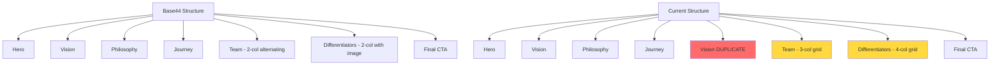

# About Page Discrepancy Analysis

## Executive Summary

This document compares the Base44 export files (the original online website) with the current local Next.js website's about page. The analysis reveals significant structural and content differences, particularly in the sections following "Our journey" timeline.

---

## Page Structure Comparison

### Base44 Export (Original Online Version)

1. **Hero Section** - Two column layout with H1 and square image
2. **Vision Section** - Black background, centered text
3. **Philosophy Section** - Animated gradient background
4. **Journey Section** - Timeline with 5 milestones (2010, 2011, 2018, 2023, 2025)
5. **Team Section** - "Meet the team" with detailed member profiles
6. **Differentiators Section** - "What sets us apart" with 4 principles
7. **Final CTA** - "Discover your sound path"

### Current Local Website (Next.js)

1. **Hero Section** - Two column layout with H1 and square image ✓
2. **Vision Section** - Black background, centered text ✓
3. **Philosophy Section** - Animated gradient background ✓
4. **Journey Section** - Timeline with 5 milestones ✓
5. **Vision Section (DUPLICATE)** - Black background, repeated content ❌
6. **Team Section** - Different layout, atmospheric design ❌
7. **Differentiators Section** - Different layout, 4-column grid ❌
8. **Final CTA** - Uses FinalCTA component ✓

---

## Detailed Discrepancies

### 1. Duplicate Vision Section

**Location:** After Journey section (line 194-213 in [`page.tsx`](app/[lang]/about/page.tsx:194))

**Issue:** The Vision section appears twice on the page. The second occurrence (lines 194-213) is a duplicate with a different styling (black background, uppercase subtitle).

**Base44 Version:** Vision section appears only once (lines 278-296 in [`about.jsx`](Base44_sensear_files_EN_GR/English/src/pages/about.jsx:278))

**Current Local Version:**
- First Vision: Lines 91-127 (correct)
- Second Vision: Lines 194-213 (duplicate, should be removed)

---

### 2. Team Section - Major Layout Differences

**Location:** Lines 215-267 in [`page.tsx`](app/[lang]/about/page.tsx:215)

**Base44 Version (Lines 504-640):**
- Background: Full-width image with warm silver foil texture
- Heading: "Meet the team" (text-[2.7rem] to [3.45rem])
- Subheading: "Music obsessed, hospitality minded"
- Layout: Individual article cards for each team member
- Member cards: Two-column grid (text + image) with alternating image positions
- Team members:
  1. **George Fameliaris** - Text left, Image right
  2. **John E. Farazoumis** - Image left, Text right
  3. **Katerina Karali** - Text left, Image right
- Each member has: Name, Title, 3-paragraph bio
- Closing statement: "Together, we form SensEar..."
- CTA buttons: "Read case studies" and "Get in touch"

**Current Local Version:**
- Background: Full-width image with 40% white overlay and backdrop blur
- Heading: Uses `content.team.heading` (uppercase subtitle style)
- Subheading: Uses `content.team.subtitle`
- Layout: 3-column grid with portrait images
- Member cards: Vertical stack with image on top, text below
- Images: Grayscale with hover effect (grayscale-0, scale-105)
- Each member has: Name, Title, Bio paragraphs
- No closing statement
- No CTA buttons

**Key Differences:**
| Aspect | Base44 | Current Local |
|--------|--------|---------------|
| Background | Direct image | Image + 40% white overlay + blur |
| Heading style | Large, bold | Uppercase subtitle style |
| Layout | Alternating 2-column | 3-column grid |
| Image style | Full color | Grayscale with hover |
| Member order | George → John → Katerina | Dictionary-based order |
| Closing text | Yes | No |
| CTA buttons | Yes | No |

---

### 3. Differentiators Section - Layout Differences

**Location:** Lines 269-294 in [`page.tsx`](app/[lang]/about/page.tsx:269)

**Base44 Version (Lines 642-716):**
- Background: `bg-[#faebe3]` (warm beige)
- Heading: "What sets us apart" (text-[2.7rem] to [3.45rem])
- Subheading: "Four principles that guide everything we do"
- Layout: Two-column grid (image left, content right)
- Image: Full-width image on left side
- Content: 4 items in single column with icons
- Icons: Lightbulb, Building2, SlidersHorizontal, Heart
- Items:
  1. **Branding music** - "We translate your vision into music..."
  2. **Covering all sectors** - "Music designed to complete guest journeys..."
  3. **Personalizing services** - "Our approach adapts to your style..."
  4. **Using music's unique powers** - "We understand how music shifts moods..."

**Current Local Version:**
- Background: `bg-[#faebe3]` (warm beige) ✓
- Heading: Uses `content.differentiators.heading` (uppercase subtitle style)
- Layout: 4-column grid (no image)
- Content: 4 items in horizontal grid
- Icons: Small dot in square container
- Items: Dictionary-based content

**Key Differences:**
| Aspect | Base44 | Current Local |
|--------|--------|---------------|
| Layout | 2-column (image + content) | 4-column grid |
| Image | Yes (left side) | No |
| Icons | Lucide icons (Lightbulb, etc.) | Small dot in square |
| Heading style | Large, bold | Uppercase subtitle style |
| Item layout | Vertical stack | Horizontal grid |

---

### 4. Final CTA Section

**Location:** Lines 296-302 in [`page.tsx`](app/[lang]/about/page.tsx:296)

**Base44 Version (Lines 718-738):**
- Background: Animated gradient
- Heading: "Discover your sound path"
- Text: "Explore further our unique approach through playlists curation or discover what we do for your sector."
- Buttons: "Signature playlists" and "Industries we serve"

**Current Local Version:**
- Uses `FinalCTA` component
- Content from dictionary: `content.final_cta`

**Status:** This section is functionally similar but uses a different component structure. The user mentioned this redesigned version is "kind of nice" and can be kept.

---

## Greek Version Specifics

The Greek Base44 file ([`about.jsx`](Base44_sensear_files_EN_GR/Greek/src/pages/about.jsx:1)) follows the same structure with translated content:

- **Team Section:** "Γνωρίστε την ομάδα" (Meet the team)
- **Differentiators:** "Τι μας ξεχωρίζει" (What sets us apart)
- **Final CTA:** "Ανακαλύψτε τη διαδρομή του ήχου σας" (Discover your sound path)

---

## Required Changes Summary

### High Priority (Must Fix)

1. **Remove duplicate Vision section** (lines 194-213 in [`page.tsx`](app/[lang]/about/page.tsx:194))

2. **Redesign Team section** to match Base44 layout:
   - Change background to direct image (no overlay/blur)
   - Update heading style to match Base44
   - Implement alternating 2-column layout for team members
   - Remove grayscale effect from images
   - Add closing statement
   - Add CTA buttons

3. **Redesign Differentiators section** to match Base44 layout:
   - Change to 2-column layout (image left, content right)
   - Add image on left side
   - Change icons to Lucide icons
   - Change item layout to vertical stack

### Low Priority (Optional)

4. **Final CTA section** - Keep current design as user approved

---

## Implementation Notes

### Team Section Data Structure

The current implementation uses dictionary data (`content.team.members`). The Base44 version has hardcoded content. Options:

1. **Update dictionary** to include all required fields and maintain data-driven approach
2. **Hardcode content** to match Base44 exactly
3. **Hybrid approach** - Use dictionary for translations but structure matches Base44

### Differentiators Section Data Structure

Similar to Team section, current uses dictionary (`content.differentiators.items`). Base44 has hardcoded content with specific icons.

### Image URLs

All images in Base44 use Supabase storage URLs. These should be preserved in the implementation.

---

## Visual Comparison

---

## Next Steps

1. Review this analysis with user
2. Confirm which changes to implement
3. Update dictionary files with required content
4. Implement Team section redesign
5. Implement Differentiators section redesign
6. Remove duplicate Vision section
7. Test both English and Greek versions
