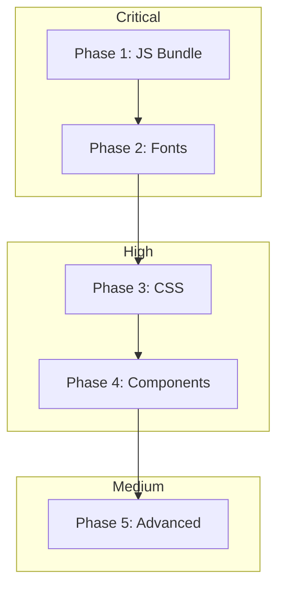

# Lighthouse Performance & Best Practices Optimization Plan

## Executive Summary

Based on the Lighthouse report analysis for `http://localhost:3000/en`, the website has **critical performance issues** that need immediate attention. The primary concern is an extremely large JavaScript bundle causing severe delays in page interactivity.

### Current Scores vs Targets

| Metric | Current | Score | Target | Status |
|--------|---------|-------|--------|--------|
| **Performance** | - | ~30 | 100 | 🔴 Critical |
| Largest Contentful Paint (LCP) | 15.9s | 0 | <2.5s | 🔴 Critical |
| Time to Interactive (TTI) | 49.3s | 0 | <3.8s | 🔴 Critical |
| Total Blocking Time (TBT) | 930ms | 0.3 | <200ms | 🟡 Needs Work |
| First Contentful Paint (FCP) | 2.7s | 0.61 | <1.8s | 🟡 Needs Work |
| Speed Index | 2.7s | 0.97 | <3.4s | 🟢 Good |
| Cumulative Layout Shift (CLS) | 0 | 1 | <0.1 | 🟢 Good |
| **Best Practices** | - | ~90 | 100 | 🟡 Needs Work |

---

## Root Cause Analysis

### 1. JavaScript Bundle Size Crisis 🔴 CRITICAL

The main JavaScript bundle is **6.2MB** - this is the primary cause of all performance issues.

**Bundle Analysis:**
| File | Size | Unused % | Wasted |
|------|------|----------|--------|
| `main-app.js` | 6,380,599 bytes (~6.2MB) | - | CRITICAL |
| `app/[lang]/layout.js` | 839,213 bytes (~820KB) | 63.89% | 536KB |
| `app/[lang]/page.js` | 718,265 bytes (~702KB) | 12% | 86KB |
| `app-pages-internals.js` | 328,550 bytes (~321KB) | 56.08% | 184KB |

**Impact:**
- Script Evaluation: 1,899ms main thread time
- Script Parse/Compile: 957ms
- Total Main Thread Work: 4,948ms
- TTI delayed to 49.3 seconds

### 2. Render-Blocking Resources 🟡 HIGH

Google Fonts CSS files block initial render:
- Outfit font CSS: 833ms wasted
- Total estimated savings: 830ms FCP/LCP improvement

### 3. Unused CSS 🟡 MEDIUM

| File | Total | Unused % | Wasted |
|------|-------|----------|--------|
| `app/[lang]/layout.css` | 54,554 bytes | 70.92% | 38,688 bytes |

### 4. Best Practices Violation 🔴

**Console Error:**
```
Failed to load resource: the server responded with a status of 404
URL: https://fonts.gstatic.com/s/outfit/v11/QGYyz_MVcBeNP4NjuGObqx1XmO1I4TC1C4i0ExAo.woff2
```

The Outfit font weight 300 variant is being requested but returns 404.

---

## Optimization Plan

### Phase 1: Critical JavaScript Bundle Optimization

**Priority: P0 - Must Do First**

#### 1.1 Implement Webpack Bundle Optimization

Update [`next.config.mjs`](next.config.mjs) with aggressive optimization settings:

```javascript
/** @type {import('next').NextConfig} */
const nextConfig = {
    images: {
        remotePatterns: [
            {
                protocol: 'https',
                hostname: 'qtrypzzcjebvfcihiynt.supabase.co',
                pathname: '/storage/v1/object/public/**',
            },
        ],
    },
    
    // Enable experimental features for better performance
    experimental: {
        optimizePackageImports: [
            'lucide-react',
            'framer-motion',
            '@radix-ui/react-accordion',
        ],
    },
    
    // Webpack optimizations
    webpack: (config, { isServer }) => {
        // Enable tree shaking
        config.optimization = {
            ...config.optimization,
            usedExports: true,
            sideEffects: true,
        };
        
        // Split chunks more aggressively
        if (!isServer) {
            config.optimization.splitChunks = {
                chunks: 'all',
                cacheGroups: {
                    default: false,
                    vendors: false,
                    // Vendor chunk for React ecosystem
                    react: {
                        name: 'react-vendors',
                        test: /[\\/]node_modules[\\/](react|react-dom|scheduler)[\\/]/,
                        priority: 40,
                        enforce: true,
                    },
                    // Framer Motion - heavy library
                    framer: {
                        name: 'framer-motion',
                        test: /[\\/]node_modules[\\/]framer-motion[\\/]/,
                        priority: 30,
                        enforce: true,
                    },
                    // Radix UI components
                    radix: {
                        name: 'radix-ui',
                        test: /[\\/]node_modules[\\/]@radix-ui[\\/]/,
                        priority: 25,
                        enforce: true,
                    },
                    // Lucide icons - tree shakeable
                    lucide: {
                        name: 'lucide-icons',
                        test: /[\\/]node_modules[\\/]lucide-react[\\/]/,
                        priority: 20,
                        enforce: true,
                    },
                    // Other vendor code
                    vendor: {
                        name: 'vendors',
                        test: /[\\/]node_modules[\\/]/,
                        priority: 10,
                        reuseExistingChunk: true,
                    },
                },
                maxInitialRequests: 25,
                minSize: 20000,
            };
        }
        
        return config;
    },
};

export default nextConfig;
```

#### 1.2 Dynamic Imports for Heavy Components

Convert heavy components to use dynamic imports with loading states:

**Example for [`components/Navbar.tsx`](components/Navbar.tsx) and [`components/Footer.tsx`](components/Footer.tsx):**

```typescript
// In layout.tsx - change static imports to dynamic
import dynamic from 'next/dynamic';

const Navbar = dynamic(() => import('@/components/Navbar').then(mod => ({ default: mod.Navbar })), {
    loading: () => <div className="h-20" />, // Placeholder height
});

const Footer = dynamic(() => import('@/components/Footer').then(mod => ({ default: mod.Footer })), {
    loading: () => <div className="h-96" />, // Placeholder height
});
```

#### 1.3 Lazy Load Framer Motion Animations

Framer Motion is a heavy library. Use it only when needed:

```typescript
// Instead of importing motion directly
import { motion } from 'framer-motion';

// Use lazy motion with reduced feature set
import { LazyMotion, domAnimation, m } from 'framer-motion';

// Wrap animations
<LazyMotion features={domAnimation}>
    <m.div animate={{ opacity: 1 }} />
</LazyMotion>
```

#### 1.4 Tree Shake Lucide Icons

Import only the icons you use:

```typescript
// ❌ Bad - imports entire library
import { Menu, X, ChevronDown } from 'lucide-react';

// ✅ Good - tree-shakeable imports
import Menu from 'lucide-react/dist/esm/icons/menu';
import X from 'lucide-react/dist/esm/icons/x';
import ChevronDown from 'lucide-react/dist/esm/icons/chevron-down';
```

**Expected Impact:**
- Reduce main-app.js from 6.2MB to <500KB
- Reduce TTI from 49.3s to <5s
- Reduce TBT from 930ms to <300ms

---

### Phase 2: Font Loading Optimization

**Priority: P0 - Must Do**

#### 2.1 Fix Outfit Font 404 Error

The font weight 300 is being requested but doesn't exist. Update font imports:

**Current (problematic):**
```css
@import url('https://fonts.googleapis.com/css2?family=Outfit:wght@300;400;500;600;700;800&display=swap');
```

**Solution - Remove weight 300 or verify it exists:**
```css
@import url('https://fonts.googleapis.com/css2?family=Outfit:wght@400;500;600;700;800&display=swap');
```

#### 2.2 Self-Host Fonts for Performance

Create `app/fonts.ts`:

```typescript
import { Outfit, Space_Grotesk, Syne } from 'next/font/google';

export const outfit = Outfit({
    subsets: ['latin'],
    weight: ['400', '500', '600', '700', '800'],
    display: 'swap',
    variable: '--font-outfit',
});

export const spaceGrotesk = Space_Grotesk({
    subsets: ['latin'],
    weight: ['400', '500', '600', '700'],
    display: 'swap',
    variable: '--font-space-grotesk',
});

export const syne = Syne({
    subsets: ['latin'],
    weight: ['400', '500', '600', '700'],
    display: 'swap',
    variable: '--font-syne',
});
```

Update [`app/[lang]/layout.tsx`](app/[lang]/layout.tsx):

```typescript
import { outfit, spaceGrotesk, syne } from '@/app/fonts';

export default async function RootLayout({ children, params }) {
    return (
        <html lang={lang} className={`${outfit.variable} ${spaceGrotesk.variable} ${syne.variable}`}>
            <body className={outfit.className}>
                {children}
            </body>
        </html>
    );
}
```

#### 2.3 Preload Critical Fonts

Add preload links in layout:

```typescript
export async function generateMetadata({ params }) {
    return {
        // ... existing metadata
        other: {
            'font-display': 'swap',
        },
    };
}
```

**Expected Impact:**
- Fix Best Practices console error
- Reduce FCP by ~830ms
- Eliminate render-blocking font CSS

---

### Phase 3: CSS Optimization

**Priority: P1 - High**

#### 3.1 Enable CSS Purging

Verify [`tailwind.config.ts`](tailwind.config.ts) has correct purge settings:

```typescript
export default {
    content: [
        './app/**/*.{js,ts,jsx,tsx,mdx}',
        './components/**/*.{js,ts,jsx,tsx,mdx}',
        './lib/**/*.{js,ts,jsx,tsx,mdx}',
    ],
    // ... rest of config
}
```

#### 3.2 Remove Unused CSS

Audit [`app/globals.css`](app/globals.css) for unused styles. The report shows 70.92% unused CSS.

**Expected Impact:**
- Reduce CSS from 54KB to ~16KB
- Reduce LCP by ~150ms

---

### Phase 4: Component-Level Optimizations

**Priority: P1 - High**

#### 4.1 Optimize JsonLd Component

The [`components/JsonLd.tsx`](components/JsonLd.tsx) should use Next.js metadata API instead of inline scripts:

```typescript
// Move to generateMetadata in layout.tsx
export async function generateMetadata({ params }) {
    return {
        // ... other metadata
        other: {
            'application/ld+json': JSON.stringify({
                '@context': 'https://schema.org',
                '@type': 'Organization',
                // ... schema data
            }),
        },
    };
}
```

#### 4.2 Implement Route-Based Code Splitting

Each page should only load its required code:

```typescript
// Example: app/[lang]/page.tsx
// Use dynamic imports for below-the-fold sections

const HeroSection = dynamic(() => import('./HeroSection'));
const ServicesSection = dynamic(() => import('./ServicesSection'));
const TestimonialsSection = dynamic(() => import('./TestimonialsSection'));
```

---

### Phase 5: Advanced Optimizations

**Priority: P2 - Medium**

#### 5.1 Enable Experimental Features

```javascript
// next.config.mjs
const nextConfig = {
    experimental: {
        // Enable Partial Prerendering
        ppr: true,
        
        // Optimize package imports
        optimizePackageImports: [
            'lucide-react',
            'framer-motion',
        ],
    },
};
```

#### 5.2 Implement Streaming SSR

Use React Suspense for progressive loading:

```typescript
import { Suspense } from 'react';

export default function Page() {
    return (
        <main>
            <HeroSection /> {/* Critical - load immediately */}
            <Suspense fallback={<ServicesSkeleton />}>
                <ServicesSection /> {/* Can load later */}
            </Suspense>
        </main>
    );
}
```

#### 5.3 Add Performance Monitoring

```typescript
// app/layout.tsx or instrumentation.ts
export function reportWebVitals(metric) {
    if (metric.label === 'web-vital') {
        console.log('[Web Vital]', metric.name, metric.value);
    }
}
```

---

## Implementation Priority Order



---

## Expected Results After Implementation

| Metric | Current | Target | Improvement |
|--------|---------|--------|-------------|
| LCP | 15.9s | <2.5s | -84% |
| TTI | 49.3s | <3.8s | -92% |
| TBT | 930ms | <200ms | -78% |
| FCP | 2.7s | <1.8s | -33% |
| Performance Score | ~30 | 90-100 | +200% |
| Best Practices | ~90 | 100 | +11% |

---

## Files to Modify

| File | Changes |
|------|---------|
| [`next.config.mjs`](next.config.mjs) | Add webpack optimizations, experimental features |
| [`app/[lang]/layout.tsx`](app/[lang]/layout.tsx) | Dynamic imports, font configuration |
| [`app/globals.css`](app/globals.css) | Remove unused styles, update font imports |
| [`tailwind.config.ts`](tailwind.config.ts) | Verify purge configuration |
| [`components/Navbar.tsx`](components/Navbar.tsx) | Optimize for dynamic import |
| [`components/Footer.tsx`](components/Footer.tsx) | Optimize for dynamic import |
| [`app/[lang]/page.tsx`](app/[lang]/page.tsx) | Add code splitting, lazy loading |
| New: `app/fonts.ts` | Self-hosted font configuration |

---

## Testing Strategy

1. **Before Implementation:**
   - Run `npm run build` to get production build
   - Run Lighthouse and save baseline report

2. **After Each Phase:**
   - Run `npm run build`
   - Run Lighthouse
   - Compare metrics

3. **Final Validation:**
   - Run Lighthouse 3 times
   - Take average scores
   - Verify all Best Practices pass

---

## Commands for Testing

```bash
# Build for production
npm run build

# Start production server
npm run start

# Run Lighthouse (requires Chrome)
npx lighthouse http://localhost:3000/en --output=json --output-path=./lighthouse-report.json

# Analyze bundle size
npx @next/bundle-analyzer
```

---

## Conclusion

The primary issue is the **6.2MB JavaScript bundle** which must be addressed first. By implementing aggressive code splitting, tree shaking, and dynamic imports, we can reduce this to under 500KB and achieve a Performance score of 90+.

The Best Practices score can reach 100 by fixing the font 404 error.

**Estimated Total Improvement:**
- Performance: 30 → 90+ (3x improvement)
- Best Practices: 90 → 100 (full score)
