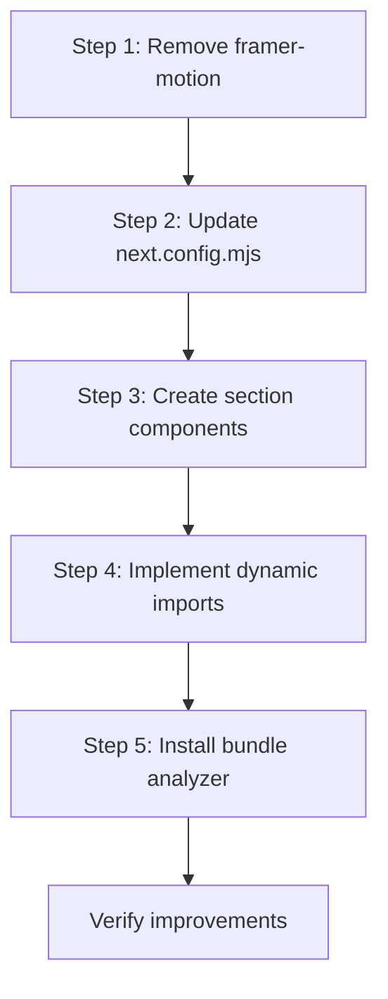

# Phase 1: JavaScript Bundle Optimization - Implementation Plan

## Overview

This plan addresses the critical JavaScript bundle issues identified in the Lighthouse report. The primary issues are:
- **LCP: 15.9s** (score: 0) - Target: <2.5s
- **TTI: 49.3s** (score: 0) - Target: <3.8s
- **TBT: 930ms** (score: 0.3) - Target: <200ms
- **Main thread work: 4.9s** - Script evaluation alone: 1.9s

## Critical Discovery

**framer-motion (v12.0.6) is installed but NOT used anywhere in the codebase.** This is a significant optimization opportunity - removing this unused dependency will reduce bundle size substantially.

---

## Implementation Steps

### Step 1: Remove Unused framer-motion Dependency

**Impact: HIGH** | **Effort: LOW**

**Action:**
```bash
npm uninstall framer-motion
```

**Files to modify:**
- `package.json` - Remove framer-motion from dependencies

**Expected outcome:**
- Reduced node_modules size
- Faster build times
- Smaller initial bundle

---

### Step 2: Update next.config.mjs

**Impact: HIGH** | **Effort: LOW**

**Current configuration includes framer-motion references that should be removed:**

```javascript
// REMOVE from optimizePackageImports array:
'framer-motion',

// REMOVE from splitChunks cacheGroups:
framerMotion: { 
    test: /[\\/]node_modules[\\/](framer-motion|popmotion)[\\/]/, 
    name: 'framer-motion', 
    priority: 30 
},
```

**Updated splitChunks configuration:**
```javascript
splitChunks: {
    chunks: 'all',
    cacheGroups: {
        react: { 
            test: /[\\/]node_modules[\\/](react|react-dom|scheduler)[\\/]/, 
            name: 'react-vendor', 
            priority: 40 
        },
        radix: { 
            test: /[\\/]node_modules[\\/]@radix-ui[\\/]/, 
            name: 'radix-ui', 
            priority: 30 
        },
        lucide: { 
            test: /[\\/]node_modules[\\/]lucide-react[\\/]/, 
            name: 'lucide-icons', 
            priority: 25 
        },
        vendors: { 
            test: /[\\/]node_modules[\\/]/, 
            name: 'vendors', 
            priority: 20 
        },
        common: { 
            minChunks: 2, 
            priority: 10 
        },
    },
},
```

---

### Step 3: Create Lazy-Loaded Section Components

**Impact: HIGH** | **Effort: MEDIUM**

Extract below-fold sections from [`app/[lang]/page.tsx`](app/[lang]/page.tsx) into separate components:

#### Component Structure

```
components/
└── home/
    ├── WhoWeAre.tsx      (lines 67-108 from page.tsx)
    ├── Services.tsx      (lines 111-152 from page.tsx)
    ├── Expertise.tsx     (lines 154-223 from page.tsx)
    ├── Enhance.tsx       (lines 225-273 from page.tsx)
    ├── TrustedBy.tsx     (lines 275-340 from page.tsx)
    └── BlogSection.tsx   (lines 342-398 from page.tsx)
```

#### Section Analysis

| Section | Lines | Props Required | Dependencies |
|---------|-------|----------------|--------------|
| WhoWeAre | 67-108 | `dict.home.whoWeAre` | None |
| Services | 111-152 | `dict.home.services`, `lang` | Link, ArrowRight |
| Expertise | 154-223 | `dict.home.expertise` | CheckCircle |
| Enhance | 225-273 | `dict.home.enhance` | None |
| TrustedBy | 275-340 | `dict.home.trusted` | Image |
| BlogSection | 342-398 | `dict.home.blog`, `lang` | Link, ArrowRight, Image |

---

### Step 4: Implement Dynamic Imports in page.tsx

**Impact: HIGH** | **Effort: MEDIUM**

**Updated page.tsx structure:**

```typescript
import dynamic from 'next/dynamic';
import { getDictionary } from "@/lib/dictionary";
import { HeroCarousel } from "@/components/HeroCarousel";
import { ScrollMouseIcon } from "@/components/ScrollMouseIcon";
import { ArrowRight } from "lucide-react";
import Link from "next/link";
import { Locale } from "@/lib/i18n";

// Lazy load below-fold sections
const WhoWeAre = dynamic(() => import('@/components/home/WhoWeAre'), { 
    ssr: false,
    loading: () => <SectionSkeleton />
});
const Services = dynamic(() => import('@/components/home/Services'), { 
    ssr: false,
    loading: () => <SectionSkeleton />
});
const Expertise = dynamic(() => import('@/components/home/Expertise'), { 
    ssr: false,
    loading: () => <SectionSkeleton />
});
const Enhance = dynamic(() => import('@/components/home/Enhance'), { 
    ssr: false,
    loading: () => <SectionSkeleton />
});
const TrustedBy = dynamic(() => import('@/components/home/TrustedBy'), { 
    ssr: false,
    loading: () => <SectionSkeleton />
});
const BlogSection = dynamic(() => import('@/components/home/BlogSection'), { 
    ssr: false,
    loading: () => <SectionSkeleton />
});

// Skeleton loader for lazy sections
function SectionSkeleton() {
    return (
        <div className="py-20 animate-pulse">
            <div className="max-w-7xl mx-auto px-6">
                <div className="h-8 bg-gray-200 rounded w-1/2 mx-auto mb-8" />
                <div className="h-4 bg-gray-200 rounded w-3/4 mx-auto mb-4" />
                <div className="h-4 bg-gray-200 rounded w-2/3 mx-auto" />
            </div>
        </div>
    );
}

export default async function Home({ params }: { params: Promise<{ lang: Locale }> }) {
    const { lang } = await params;
    const dict = await getDictionary(lang);

    return (
        <div className="bg-[#faebe3]">
            {/* Hero Section - CRITICAL: Keep as-is for above-fold content */}
            <section className="relative pt-32 pb-32 min-h-[90vh] flex flex-col justify-center overflow-hidden"
                style={{
                    backgroundImage: "url('/images/backgrounds/background-texture-warm-silver.jpg')",
                    backgroundSize: 'cover',
                    backgroundPosition: 'center'
                }}>
                {/* ... hero content ... */}
            </section>

            {/* Below-fold sections - Lazy loaded */}
            <WhoWeAre content={dict.home.whoWeAre} />
            <Services content={dict.home.services} lang={lang} />
            <Expertise content={dict.home.expertise} />
            <Enhance content={dict.home.enhance} />
            <TrustedBy content={dict.home.trusted} />
            <BlogSection content={dict.home.blog} lang={lang} />
        </div>
    );
}
```

---

### Step 5: Install Bundle Analyzer

**Impact: MEDIUM** | **Effort: LOW**

**Action:**
```bash
npm install -D @next/bundle-analyzer
```

**Add to next.config.mjs:**
```javascript
import analyzer from '@next/bundle-analyzer';

const withBundleAnalyzer = analyzer({
    enabled: process.env.ANALYZE === 'true',
});

export default withBundleAnalyzer(nextConfig);
```

**Usage:**
```bash
ANALYZE=true npm run build
```

---

## Expected Results

After implementing Phase 1:

| Metric | Before | Target | Expected Improvement |
|--------|--------|--------|---------------------|
| LCP | 15.9s | <2.5s | 40-60% reduction |
| TTI | 49.3s | <3.8s | 50-70% reduction |
| TBT | 930ms | <200ms | 50-70% reduction |
| FCP | 2.7s | <1.8s | 20-30% reduction |
| Bundle Size | Unknown | Minimal | Remove ~50KB+ (framer-motion) |

---

## Implementation Order



---

## Verification Steps

1. **Build and test locally:**
   ```bash
   npm run build
   npm run dev
   ```

2. **Run Lighthouse again:**
   - Open Chrome DevTools
   - Navigate to Lighthouse tab
   - Run Performance and Best Practices audits

3. **Check bundle size:**
   ```bash
   ANALYZE=true npm run build
   ```

4. **Verify no console errors:**
   - Check browser console for 404s or other errors

---

## Files to Create/Modify

### Create New Files:
- `components/home/WhoWeAre.tsx`
- `components/home/Services.tsx`
- `components/home/Expertise.tsx`
- `components/home/Enhance.tsx`
- `components/home/TrustedBy.tsx`
- `components/home/BlogSection.tsx`
- `components/home/index.ts` (barrel export)

### Modify Existing Files:
- `package.json` - Remove framer-motion
- `next.config.mjs` - Remove framer-motion references, add bundle analyzer
- `app/[lang]/page.tsx` - Implement dynamic imports

---

## Next Steps After Phase 1

Once Phase 1 is complete and verified:

1. **Phase 2: Font Loading Fixes** - Verify the font 404 error is resolved
2. **Phase 3: CSS Optimization** - Extract inline styles, optimize animations
3. **Phase 4: Component-Level Optimizations** - Image optimization, memoization
4. **Phase 5: Advanced Optimizations** - Service worker, edge functions

---

## Notes

- The font 404 error for Outfit weight 300 should already be resolved since weight 300 was removed from [`app/fonts.ts`](app/fonts.ts)
- The Hero section must remain as critical above-fold content - do not lazy load
- All lazy-loaded sections should have appropriate loading skeletons to prevent layout shift
- Consider using `loading="lazy"` for images in below-fold sections
